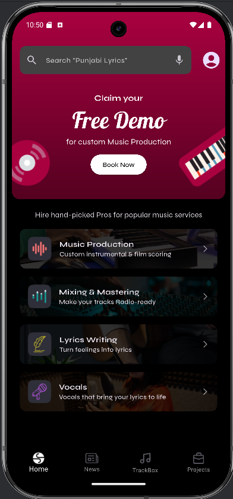

This document outlines the folder structure and development approach for the S-Rocks Music Services Flutter application.

## Core Approach

The application follows a feature-driven approach with a clear separation of concerns, utilizing:

*   **Riverpod:** For robust state management and dependency injection. This allows for decoupled components and easier testing.
*   **Repository Pattern:** To abstract data sources (like Firebase Firestore). This means UI components are not directly tied to data fetching logic, promoting cleaner architecture and easier changes to data sources in the future.
*   **Model-View-ViewModel (MVVM) like Structure (Implicitly with Riverpod):**
    *   **Models:** Define the data structures (e.g., `ServiceModel`).
    *   **Views (Screens/Widgets):** Responsible for displaying the UI and reacting to user input. They consume state from Riverpod providers.
    *   **ViewModels (Riverpod Providers):** Manage the state and business logic for the views. They interact with repositories to fetch or manipulate data.

## Folder Structure
SRocksMusic_Assignemnt/       
 ├── android/                      
 ├── ios/        
 ├── assets/               
 │     ├── fonts        
 │     ├── images       
 ├── lib/         
 │   ├── main.dart       
 │   ├── firebase_options.dart      
 │   ├── models/                   
 │   │     └── service_model.dart     
 │   ├── providers/            
 │   │     └── service_providers.dart        
 │   ├── views/       
 │   │     ├── home_screen.dart      
 │   │     └── service_detail_screen.dart       
 │   ├── widgets/                
 │         └── service_card.dart     
 ├── test/                         
 ├── firebase.json      
 ├── pubspec.yaml      
 ├── .gitignore      
 └── README.md       

**Key Directory Explanations:**

  *   **`lib/`**: The heart of the Flutter application.    
  *   **`models/`**: Contains simple Dart classes that define the structure of the data your app works with.
  *   **`providers/`**: Holds all Riverpod providers. These are responsible for providing dependencies (like a `FirebaseFirestore` instance or a `ServicesRepository`) and managing the application's state.
  *   **`views/`**: Contains the widgets that represent full screens in your application. These widgets use `ConsumerWidget` or `ConsumerStatefulWidget` from Riverpod to watch providers and rebuild when state changes.
  *   **`widgets/`**: Contains smaller, reusable UI components that are used within screens or other widgets. For example, `ServiceCard` is a widget that knows how to display a single service.
  *   **`assets/`**: Contains all the images, icons and fonts used in this application.

## App Preview

